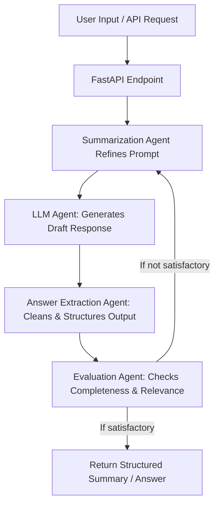
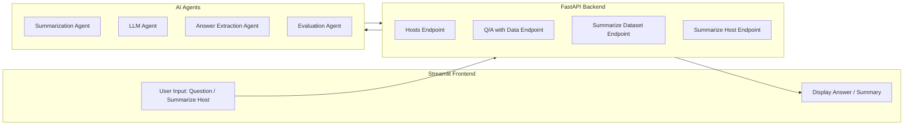

# AI-Agent-for-Summarization
## Censys Summarizer Project

## Overview
The **Censys Summarizer** is a full-stack application that provides concise and professional summaries of host scan datasets. It integrates **AI (LLM-based agent)** for generating summaries, answering questions about hosts, and providing insights into vulnerabilities, open ports, and risk levels.  

This project demonstrates both backend (FastAPI) and frontend (Streamlit) components, allowing users to interact with host data via a simple, interactive UI.  

---

## Features

- **Hosts Overview:** View all hosts with key metadata like IP, location, and risk level.  
- **Host Details:** Inspect detailed information about a single host.  
- **Q/A with Data:** Ask natural language questions about the dataset and get AI-generated answers.  
- **Summarize Dataset:** Generate an AI-powered summary of the entire host scan dataset.  
- **Summarize Host:** Generate a professional summary for a specific host, including risk, vulnerabilities, malware, and notable patterns.  

---

## Tech Stack

| Component   | Technology |
|------------|------------|
| Backend     | FastAPI, Python |
| Frontend    | Streamlit |
| AI Agent    | Custom LLM integration (`agent.py`) |
| Data Storage| In-memory Python dictionaries (`DATA`, `HOSTS_BY_IP`) |
| HTTP Requests | `requests` (used in Streamlit UI) |

---

## Project Structure
```
censys-summarizer/
│
├── main.py # FastAPI backend with all endpoints
├── agent.py # AI integration (LLM calls and summarization pipeline)
├── actions.py # Defines all agent actions (query handling, evaluation, summarization steps)
├── prompts.py # Contains system prompts (e.g., Thought → Action → Pause templates)
├── utils.py # Host data (DATA, HOSTS_BY_IP, summarize_dataset, qa_dataset) + helper functions
├── app.py # Streamlit frontend UI
├── hosts_dataset.json # Hosts dataset with IPs, vulnerabilities, risk levels, etc.
├── requirements.txt # Python dependencies
└── README.md # Project documentation
```

## Setup Instructions

1. **Clone the repository:**
```
git clone https://github.com/mokshdagangrade/AI-Agent-for-Summarization.git
cd censys-summarizer
```

2. **Create a virtual environment and install dependencies:**
```
python3 -m venv venv
source venv/bin/activate
pip install -r requirements.txt
```

3. **Set up your API keys:**  
  Create a .env file in the project root:
```
HF_API_KEY=your_huggingface_api_key_here
```

4. **Run the FastAPI backend:**
```
uvicorn main:app --reload --port 8000
```

5. **Run the Streamlit frontend:**
```
streamlit run app.py
```

---

## Usage Instructions

### Hosts Overview
- Navigate to **Hosts Overview** in the Streamlit sidebar.
- View all hosts in a table, including IP, location, and risk.

### Host Details
- Navigate to **Host Details**.
- Enter a host IP to view detailed information in JSON format.

### Q/A with Data
- Navigate to **Q/A with Data**.
- Type your natural language question about the dataset.
- Click Get Answer to retrieve an AI-generated response.

### Summarize Dataset
- Navigate to **Summarize Dataset**.
- Click Generate Summary to get a detailed summary of the entire dataset.

### Summarize Host
- Navigate to **Summarize Host**.
- Enter a host IP.
- Click Generate Host Summary to get a professional summary of that host.

*Note: On the top-right corner, a "running" indicator will appear while the result is being processed.*

## Agent Workflow with Evaluation Loop

The agent processes queries and summaries in a feedback loop to improve the quality of responses:




## Full-Stack Agent Ecosystem

The project uses a frontend (Streamlit) to interact with backend AI agents running behind FastAPI.


---
## Sample Questions
- Summarize host 192.168.0.12 and list all open ports and detected vulnerabilities.
- Provide a detailed risk assessment for host 10.0.1.45 including any malware indicators.
- What are the missing CVEs or patches for host 172.16.5.33?
- Generate a professional summary of host 1.92.135.168 with risk, services, and vulnerabilities.
- Which hosts have the highest risk levels in the dataset?
- Identify patterns in vulnerabilities across the network.

---
## Assumptions
- Host data is stored in memory as Python dictionaries (DATA and HOSTS_BY_IP).
- The AI agent can interpret structured host data.
- Users interact with the system via Streamlit; no authentication is implemented.
---
## Limitations

- **Hardware Constraints (CPU-only):**  
  The current implementation runs entirely on CPU, which limits the speed of inference and prevents the use of larger, GPU-optimized models.  

- **LLM Model Selection:**  
  Currently, the system uses lightweight hosted models (via Hugging Face/OpenAI APIs). With a valid **OpenAI API key**, larger models like **GPT-4o** or **GPT-4 Turbo** could be integrated for higher-quality summaries.  

- **No Fine-Tuning Yet:**  
  The AI agents rely on prompt engineering rather than domain-specific fine-tuning. This may lead to occasional generic answers or lack of deep domain insights.  

---

## Potential Enhancements with Better Resources

- **GPU Acceleration:**  
  Running on a GPU-enabled environment would allow use of open-source, high-performing models such as:
  - **LLaMA-3 (Meta)**
  - **Mistral-7B / Mixtral**
  - **Falcon-40B**
  - **Claude (Anthropic, via API)**
  - **GPT-4o (OpenAI, via API)**

- **Improved Summarization Quality:**  
  Larger context windows in models like GPT-4o or LLaMA-3-70B would allow more **comprehensive dataset analysis**, better **pattern detection**, and **more reliable QA responses**.  

- **Fine-Tuning / RAG Integration:**  
  With more time and compute, host metadata and vulnerabilities could be:
  - **Embedded into FAISS** for efficient semantic similarity search.  
  - **Indexed in Elasticsearch** for syntax-based keyword search.  
  - Combined into a **hybrid retrieval system (semantic + keyword match)**, improving both precision and recall for host lookups and summarizations.  

- **Scalability:**  
  Deploying with GPU-backed instances (e.g., AWS, GCP, Azure) would allow handling **bigger datasets** and **real-time summarization** without latency issues.


## Future Enhancements
- **Visual Analytics:** Add charts for risk distribution, open ports, CVEs, and malware counts.
- **Persistent Storage:** Store host data in a database instead of in-memory dictionaries.
- **Authentication:** Add login and role-based access control.
- **Enhanced AI Prompts:** Fine-tune LLM prompts for better summarization accuracy.
- **Export Functionality:** Allow exporting summaries as PDF or CSV.
- **Multi-Host Comparison:** Compare multiple hosts side by side.
